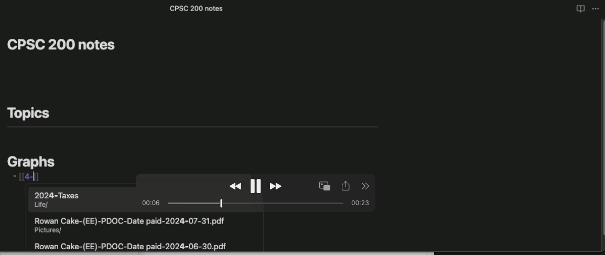

# QuickNote

### Use case:
The main use case for this plugin was to speed up my notetaking capabilities in university classes. Often there are a lot of keywords coming at you quickly and you might not have a lot of time in between to write each about each individually, and upon review find yourself with just the word left and no explanation around it. This plugin is a solution to that problem, it auto inserts a text summary written by llama 3.2 into the top of the newly created note. So upon note reviews you will atleast have some context surrounding that keyword.  

### Dependecies:
  - Python
  - Flask
  - Ollama (llama 3.2B)

### Way it works:
Once loaded **QuickNote** creates a local server that has llama3.2 running in backround. When a new note is created **QuickNote** will pass the title it was created with to llama3.2 and generate a summary based on the title along with a example and some pretty formating, then put that summary at the beging of the note. On unloaded it will kill the server 

### Example:

